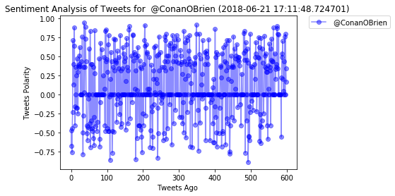
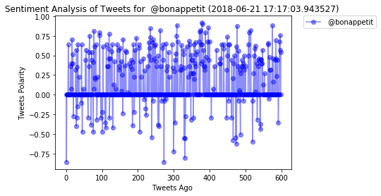
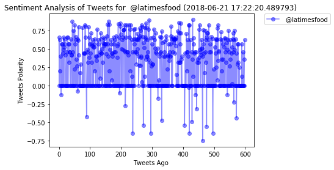

```python
# Dependencies
import tweepy
import numpy as np
from API_KEYS import(
    consumer_key,
    consumer_key_secret,
    access_token,
    access_token_secret
)
from pprint import pprint
import pandas as pd
import matplotlib.pyplot as plt
from datetime import datetime
from random import randint

import datetime
import time
#import requests


# Setup Tweepy API Authentication
auth = tweepy.OAuthHandler(consumer_key, consumer_key_secret)
auth.set_access_token(access_token, access_token_secret)
api = tweepy.API(auth, parser=tweepy.parsers.JSONParser())


# Import and Initialize Sentiment Analyzer
from vaderSentiment.vaderSentiment import SentimentIntensityAnalyzer
analyzer = SentimentIntensityAnalyzer()
```


```python

target_list=[]

def getsearch():
    
    # Target Search Term
    target_term = "@PlotBot"
    
   # Grab tweets
    public_tweets = api.search(target_term, count=1, result_type="recent")
    
    tweet=(public_tweets["statuses"][0]['text'])
    tweet=tweet.split(":")
    target_user=tweet[1]
    
    if target_user in target_list:
        #print("no new tweets")
        return ' '
    else:
        target_list.append(target_user)
        return target_user
       
    
```


```python
def gettweets(target_user):
    
    # Variables for holding sentiments
    compound_list = []

    #only create graphs if a new Twitter account is returend by getsearch()
    if target_user != ' ':
        
        # Loop through 30 pages to retrieve 500 tweets
        for x in range(1, 31):

           # Get all tweets from home feed
            public_tweets = api.user_timeline(target_user, page=x)

           # Loop through all tweets
            for tweet in public_tweets:

           # Run Vader Analysis on each tweet
               results = analyzer.polarity_scores(tweet["text"])
               compound = results["compound"]

          # Add each value to the appropriate list
               compound_list.append(compound)          
        
     # Create a dictionaty of results
        user_results = {
        "Name": target_user,
        "compound":compound_list
        }
        results_df = pd.DataFrame(user_results)
        results_df.reset_index(level=0, inplace=True)
  
    
        plt.plot(results_df["index"],results_df["compound"], 'xb-',alpha=0.45,linestyle='-', marker='o',label=target_user) 
        
        now = datetime.datetime.now()
        
        plt.title(f'Sentiment Analysis of Tweets for {target_user} ({now}) ')
        #plt.title("Sentiment Analysis of Tweets (06/20/2018)")
        plt.xlabel("Tweets Ago ")
        plt.ylabel("Tweets Polarity")

    ## create Legend and place outside of graph
        plt.legend(bbox_to_anchor=(1.05, 1), loc=2, borderaxespad=0.)
        plt.show()
    else:
        print("No new Twitter account to analyze")

```


```python
# Set timer to run function every 5 min

while True:
    #call the getsearch()function to retrieve any tweets for @PlotBot, then call gettweets() function to perform sentiment analysis and plot graph
    gettweets(getsearch())
    # Once printed, wait 300 seconds
    time.sleep(300)
   
```











    No new Twitter account to analyze


    ---------------------------------------------------------------------------

    KeyboardInterrupt                         Traceback (most recent call last)

    <ipython-input-13-25eb9308a50e> in <module>()
          5     gettweets(getsearch())
          6     # Once printed, wait 300 seconds
    ----> 7     time.sleep(300)
          8 


    KeyboardInterrupt: 

